# Introduction

What if material removed to make forests safer could also help power homes, strengthen tribal energy sovereignty, and support rural jobs?

That question sits at the heart of this project.

Across the Pacific Northwest, many tribal communities are living with multiple, overlapping challenges. Forests in many places are denser than they once were, increasing wildfire risk. At the same time, many communities are seeking more local control over their energy future, especially as energy costs rise and climate-related disruptions become more common. In regions where traditional timber economies have declined, there is also growing interest in land-based economic opportunities that support both community well-being and forest stewardship.

This project explores one possible connection between these issues: **forest biomass**.

In simple terms, forest biomass is the wood-based material stored in trees and forest vegetation. When forests are thinned for restoration or wildfire risk reduction, some of that material can potentially be used as an energy source. That means biomass may offer more than one benefit at the same time:

- it may help reduce hazardous fuel loads  
- it may provide a renewable energy alternative  
- it may support tribal energy sovereignty and resilience  
- it may create work in forestry, hauling, processing, and energy systems  

This study does **not** argue that every tribe should pursue biomass development, and it does **not** claim that every acre should be harvested. Instead, it asks a more basic and important first question:

> Where does meaningful biomass energy potential exist near major tribal lands in Oregon, Washington, and Idaho?

That is the purpose of this analysis.

# Research Question

**What is the forest bioenergy potential within 5 miles of major tribal reservations in the Pacific Northwest, and how does that potential change under different harvest rotation scenarios?**

# Why This Question Matters

This research is motivated by a practical and public-facing question, not just a technical one.

For many people, “biomass” can sound abstract. But on the ground, this topic is really about community needs:

- safer forests  
- more resilient energy systems  
- more local control over energy resources  
- more opportunities for rural and tribal economies  

For tribal nations, this question can also connect to a larger issue of **energy sovereignty** — the ability to shape energy futures in ways that reflect local priorities, local resources, and local decision-making.

That is why this project matters. It is not only about how much biomass exists. It is about what kinds of possibilities that biomass might open up, such as energy resilience, wildfire mitigation and promoting local economies

# Study Area

This project focuses on major tribal land bases in:

- Oregon  
- Washington  
- Idaho  

To keep the analysis focused on larger land bases with greater potential for forest-based management, the study emphasizes **tribal lands larger than 10,000 acres**.

A **5-mile buffer** was added around tribal lands. This buffer is meant to represent a reasonable starting point for thinking about nearby forest resources that may still be close enough to matter for hauling and local use.

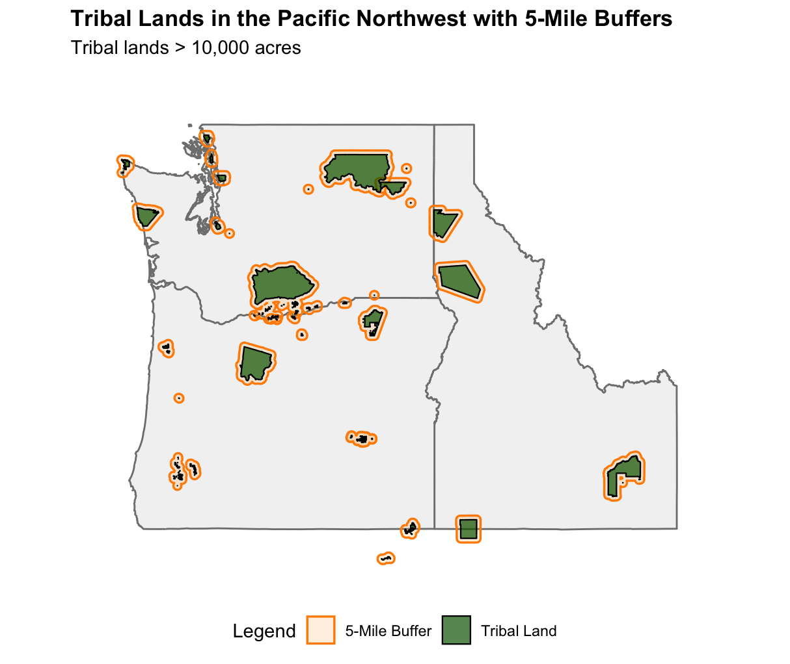

*Figure 1. Tribal lands included in the study and their surrounding 5-mile buffer zones.*

# Step-by-Step: What This Project Actually Does

A general audience should be able to follow the logic of the project in a few clear steps.

## Step 1: Identify Tribal Lands

The first step was to map major tribal land areas in the Pacific Northwest. These lands are the center of the analysis.

## Step 2: Add a 5-Mile Buffer

Next, a 5-mile buffer was drawn around each tribal land area. This created a broader “working landscape” for the study. The idea is that nearby forest resources may still be relevant to tribal communities, especially when considering restoration, hauling distance, and local energy systems.

## Step 3: Measure Forest Conditions

Several forest datasets were used to understand what the surrounding landscape looks like. These include canopy height, canopy cover, canopy bulk density, forest type, and dry biomass.

These maps help answer basic questions such as:

- How much forest material is present?
- Where are the denser forested areas?
- Which places appear to have larger wood-based resource potential?

### Forest Structure and Condition

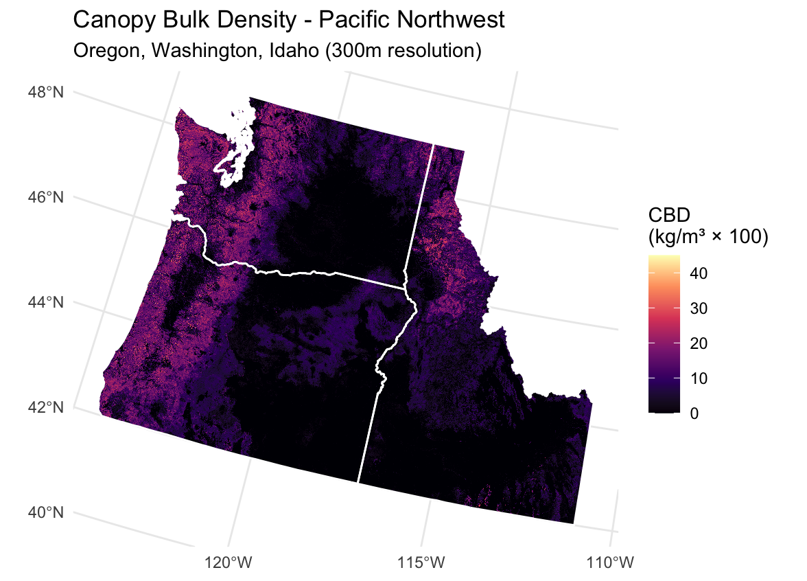

*Figure 2. Canopy bulk density across the Pacific Northwest.*

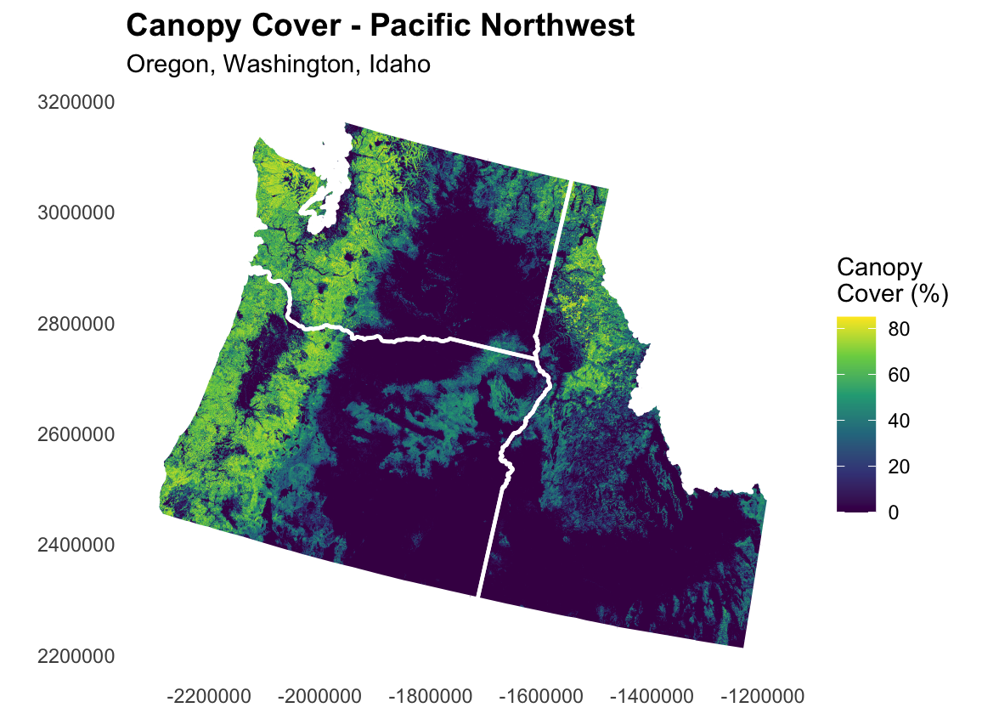

*Figure 3. Canopy cover across the Pacific Northwest.*

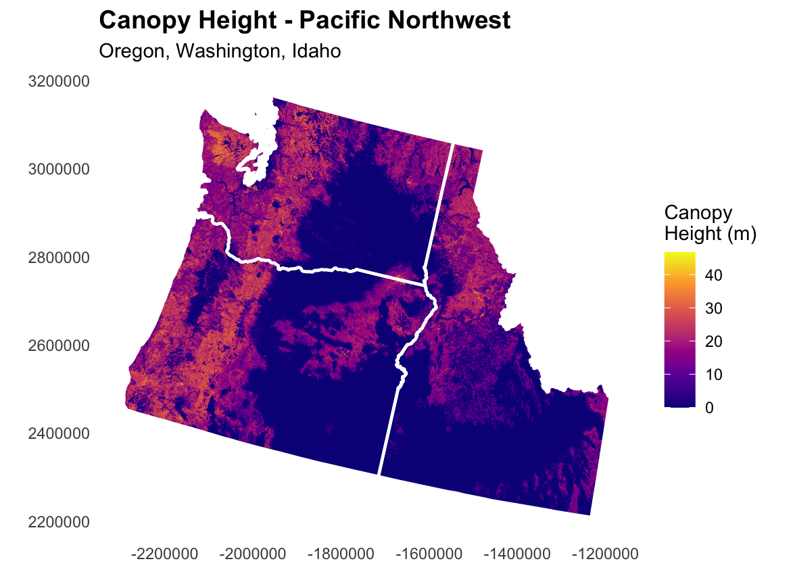

*Figure 4. Canopy height across the Pacific Northwest.*

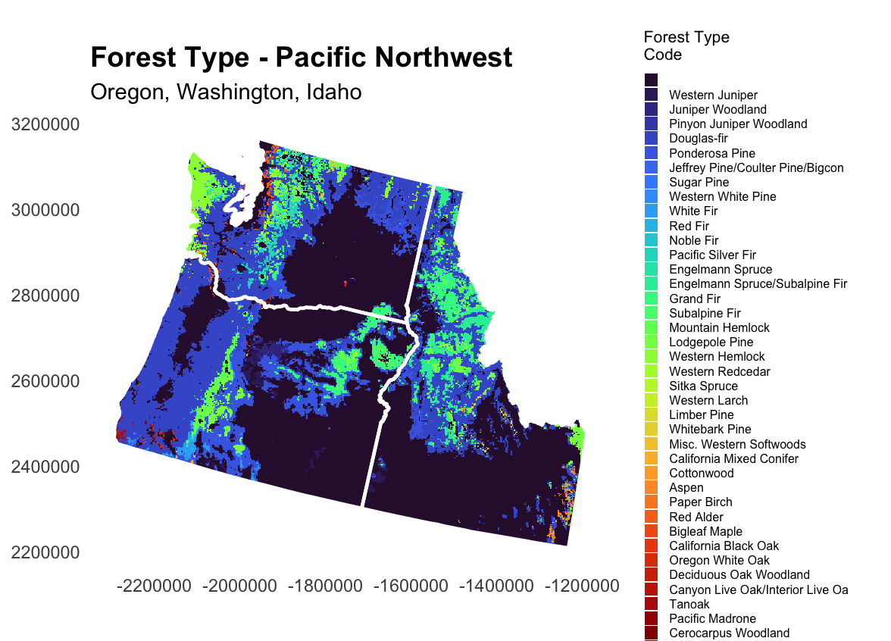

*Figure 5. Forest type distribution across the Pacific Northwest.*

## Step 4: Measure Dry Biomass

The key resource variable in this study is **dry biomass**.

Dry biomass is the estimated amount of dry wood material above ground. In this project, it is measured in **Mg**, or **megagrams**.

A simple way to think about it is:

- **1 Mg = 1 metric ton**

So when this report talks about millions of Mg, it is talking about millions of metric tons of dry wood material.

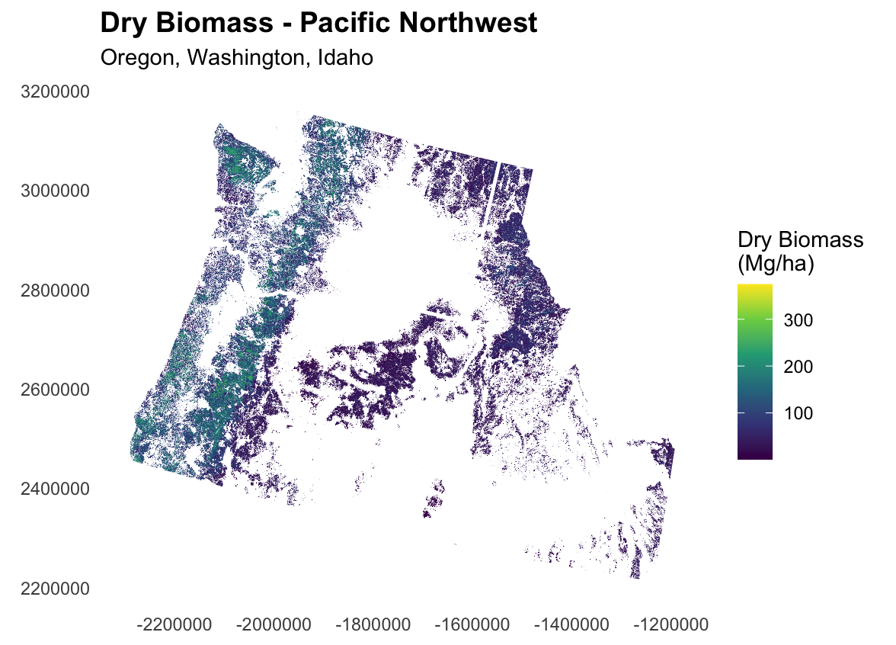

*Figure 6. Dry biomass distribution across the Pacific Northwest.*

## Step 5: Overlay Biomass with Tribal Lands and Buffers

After mapping biomass, the study overlays that information with tribal lands and their 5-mile buffers.

This helps identify where tribal geographies and forest biomass resources overlap.

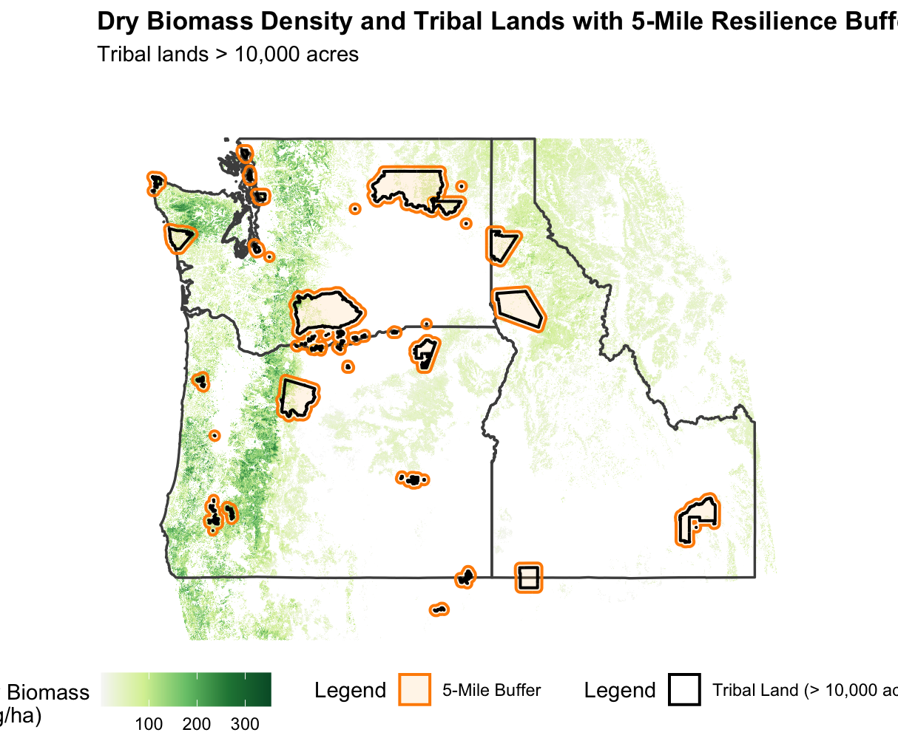

*Figure 7. Biomass density in relation to tribal lands and the 5-mile buffer.*

## Step 6: Convert Biomass into Energy Potential

Once the biomass amount is estimated, it can be translated into a potential energy value.

This does **not** mean all of the biomass should or would be used. It simply gives a way to understand the scale of the resource.

## Step 7: Test Harvest Scenarios

Finally, the study tests different scenarios for how biomass might be spread over time.

Instead of assuming all material is removed at once, the project looks at annualized harvest cycles. This makes the results easier to interpret as a long-term resource rather than a one-time extraction.

# The Math Behind the Calculations

One goal of this project is to make the math understandable, even for readers who do not work with GIS or energy data.

## 1. From Biomass to Energy

The study uses a **Higher Heating Value (HHV)** assumption of:

$$
19.0 \text{ GJ/Mg}
$$

This means each megagram of dry biomass is assumed to contain about **19 gigajoules** of energy.

To express that in megawatt-hours, the study uses the conversion:

$$
1 \text{ GJ} = 0.277778 \text{ MWh}
$$

So the energy per megagram becomes:

$$
19.0 \times 0.277778 \approx 5.28 \text{ MWh per Mg}
$$

That leads to the basic formula:

$$
\text{Total Energy (MWh)} = \text{Dry Biomass (Mg)} \times 5.28
$$

## 2. From Energy to Household Equivalents

To make the results easier for the public to understand, the study also converts energy into an estimated number of homes.

The project uses an average annual household electricity use of about:

$$
10.8 \text{ MWh per home per year}
$$

So:

$$
\text{Homes Powered} = \frac{\text{Energy (MWh)}}{10.8}
$$

This gives a rough “household equivalent” that helps communicate scale.

## 3. Thinning Scenario Math

The study also models a **40% thinning scenario**. This means the analysis assumes that only 40% of the total biomass resource is removed within a given management cycle.

That amount is then spread across different rotation lengths:

- 20 years  
- 30 years  
- 40 years  

The annual energy formula is:

$$
\text{Annual Energy (MWh/year)} = \frac{\text{Total Energy} \times 0.40}{\text{Rotation Length}}
$$

And annual household equivalents are calculated as:

$$
\text{Annual Homes Powered} = \frac{\text{Annual Energy}}{10.8}
$$

## Example: Yakama

For Yakama, the total theoretical energy potential shown in the results table is:

$$
111{,}113{,}567 \text{ MWh}
$$

Under the 40% thinning scenario and a 20-year cycle:

$$
\frac{111{,}113{,}567 \times 0.40}{20} = 2{,}222{,}271 \text{ MWh/year}
$$

Then the household equivalent becomes:

$$
\frac{2{,}222{,}271}{10.8} \approx 205{,}766 \text{ homes}
$$

This is the logic behind the scenario tables in the results.

# Main Findings

## Total Theoretical Resource for the Top 10 Tribes

The top 10 tribal land bases in the study account for:

- **104,181,929 Mg** of standing dry biomass  
- **549,849,508 MWh** of total theoretical energy potential  
- **50,911,993 household equivalents** as a scale comparison  

These numbers are large, but they should be understood carefully. They describe the **overall scale of the resource**, not what should be harvested all at once.

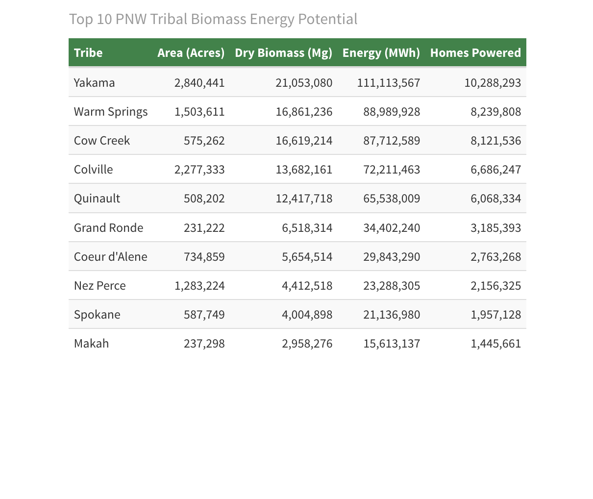

*Figure 8. Top 10 tribes by total biomass energy potential.*

## Energy Potential Is Not Evenly Distributed

The results show that biomass energy potential is concentrated in a relatively small number of places.

The leading tribes by total potential are:

- Yakama  
- Warm Springs  
- Cow Creek  
- Colville  
- Quinault  

Together, these five account for the large majority of the top-10 total. This matters because it suggests that future biomass conversations may be most relevant in specific geographic hotspots, rather than evenly across the entire region.

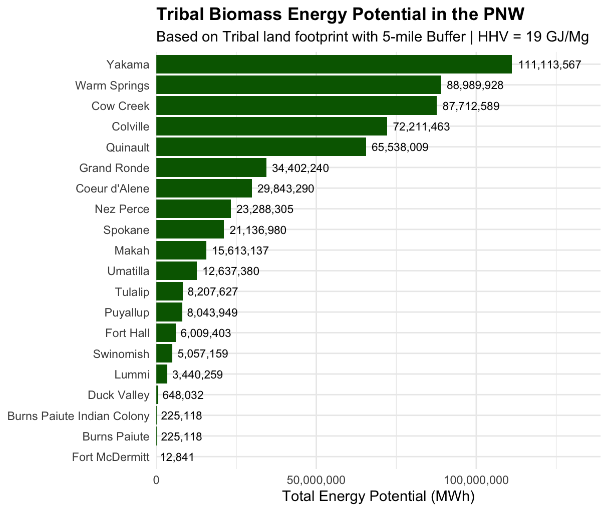

*Figure 9. Total theoretical biomass energy potential by tribe.*

## Annual Scenarios Tell a More Realistic Story

A more useful public question is not “How much energy exists in total?” but:

> How much energy could be available each year under a more realistic management approach?

That is where the thinning scenarios matter.

Under a **40% thinning scenario**, the top 10 tribes together could support approximately:

- **10,996,991 MWh/year** on a 20-year cycle  
- **7,331,327 MWh/year** on a 30-year cycle  
- **5,498,495 MWh/year** on a 40-year cycle  

In household-equivalent terms, that is about:

- **1,018,240 homes/year** on a 20-year cycle  
- **678,826 homes/year** on a 30-year cycle  
- **509,119 homes/year** on a 40-year cycle  

These are still large numbers, but they tell a more grounded story than the total resource estimate. They show how biomass might function as a long-term regional energy resource under a management scenario, rather than as a one-time stockpile.

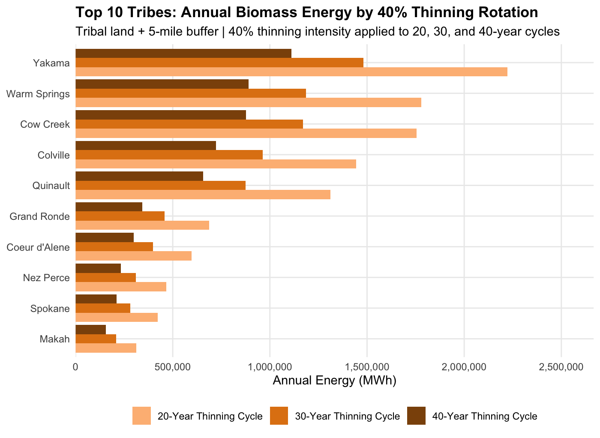

*Figure 10. Annual biomass energy by tribe under 40% thinning scenarios.*

 by Rotation Cycle.png)

*Figure 11. Annual thinning scenario results for the top 10 tribes.*

# Why These Findings Matter

The importance of this project is not just in the numbers. It is in what those numbers suggest.

## 1. Biomass Could Support Energy Sovereignty

For tribal communities, local energy systems can matter for more than economics. They can also matter for self-determination, resilience, and long-term planning.

Biomass has the potential to become part of a broader energy sovereignty strategy when it is community-led, locally appropriate, and aligned with tribal priorities.

In plain language, this means energy produced closer to home, using local resources, with more local control over the benefits.

## 2. Biomass Could Support Wildfire Mitigation

In many places, hazardous fuels and dense forest conditions increase wildfire risk.

That means some of the same material that poses a fire hazard may also represent an energy opportunity. If done carefully, thinning for forest health and thinning for biomass use do not have to be competing ideas. They can be part of the same conversation.

This does **not** mean biomass is a cure-all for wildfire. But it does suggest that restoration-oriented thinning could provide multiple benefits at once.

## 3. Biomass Could Support Rural and Tribal Jobs

Many forest-based regions have experienced long-term changes in timber markets and wood-processing infrastructure.

Biomass will not replace the historical wood products economy, but it may offer a partial and place-based opportunity in some communities. That could include jobs and contracting opportunities in areas such as:

- forest restoration  
- fuels reduction  
- hauling and logistics  
- biomass processing  
- facility operations  
- local energy planning  

For that reason, biomass should be understood not only as an energy topic, but also as part of a wider discussion about rural development and land-based economic opportunity.

# What This Study Does Not Yet Answer

This project is **exploratory**.

That is one of its strengths, because it opens the conversation. But it also means the results should be interpreted with care.

Several important real-world factors are not yet built into this analysis:

- **Wood type and species**: not all biomass has the same value or usability  
- **Slope and terrain**: some wood may exist on land that is difficult or expensive to access  
- **Road infrastructure**: transport depends on road quality, location, and distance  
- **Extraction costs**: removing and moving material costs money  
- **Conversion technology**: actual delivered electricity would depend on plant efficiency and system design  
- **Policy and permitting**: energy projects depend on regulation, governance, and local priorities  
- **Cultural and ecological considerations**: tribal decisions about land and energy must reflect more than resource quantity alone  

This is why the project should be seen as a **conversation starter**, not a final development blueprint.

# Important Interpretation Note

The energy estimates in this project are best understood as **resource potential** or **energy-equivalent estimates** based on biomass fuel value.

In other words:

- they show the scale of energy contained in the biomass resource  
- they do **not** yet model full real-world conversion losses, facility design, or delivered electric output  

That means actual electricity production from a biomass facility would likely be lower than the raw energy-equivalent estimates shown here.

This is an important next step for future research.

# Where This Research Can Go Next

This analysis helps answer the first question: **Where is the resource, and how large is it?**

The next phase would ask more practical questions:

- Which sites are physically feasible?
- Which locations have enough nearby biomass to support a facility?
- Where are roads, mills, or transmission lines already present?
- What are the likely extraction and hauling costs?
- What technologies are most appropriate for different tribal contexts?
- How do energy opportunities align with tribal priorities for stewardship, sovereignty, and development?

Future work could build on this study by adding:

- road network analysis  
- slope and accessibility analysis  
- facility siting analysis  
- biomass transport cost modeling  
- conversion efficiency estimates  
- tribal energy demand analysis  
- community-specific case studies  

That is where this research could become even more useful: not simply as a regional map of possibility, but as a tool for place-based planning.

# Final Reflection

At its core, this project is about possibility.

It asks whether material often treated as waste, hazard, or byproduct might instead be part of a more resilient future.

It suggests that in some places, forest biomass may offer a bridge between:

- wildfire mitigation  
- renewable energy  
- tribal energy sovereignty  
- rural economic opportunity  

Not every place will be suitable. Not every project will make sense. And not every biomass pathway will be worth pursuing.

But this analysis shows that the conversation is worth having.

The resource is there. The geography matters. The opportunities are uneven but real. And with deeper analysis, stronger partnerships, and community-led decision-making, this work can move from exploratory mapping toward practical planning.

# Appendix: Additional Visuals

## Tribal Land Area

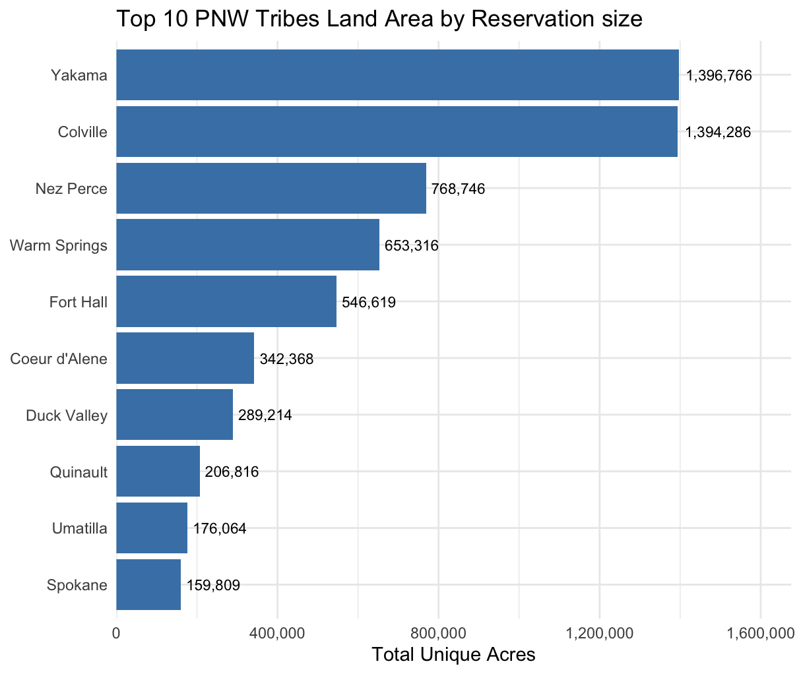

*Appendix Figure A1. Top 10 PNW tribes by reservation size.*

## Theoretical Annual Harvest Scenarios

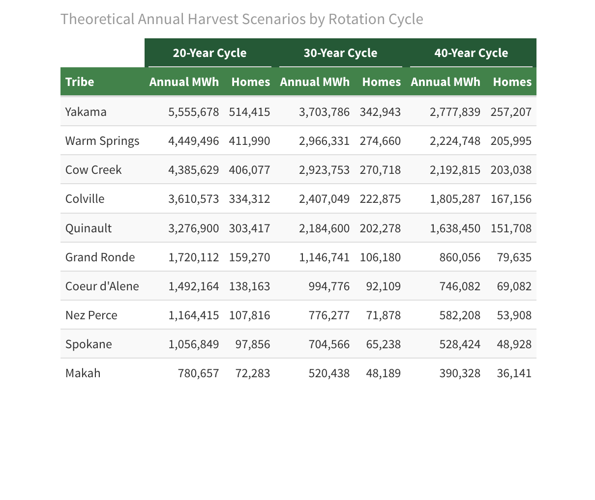

*Appendix Figure A2. Theoretical annual harvest scenarios by rotation cycle.*